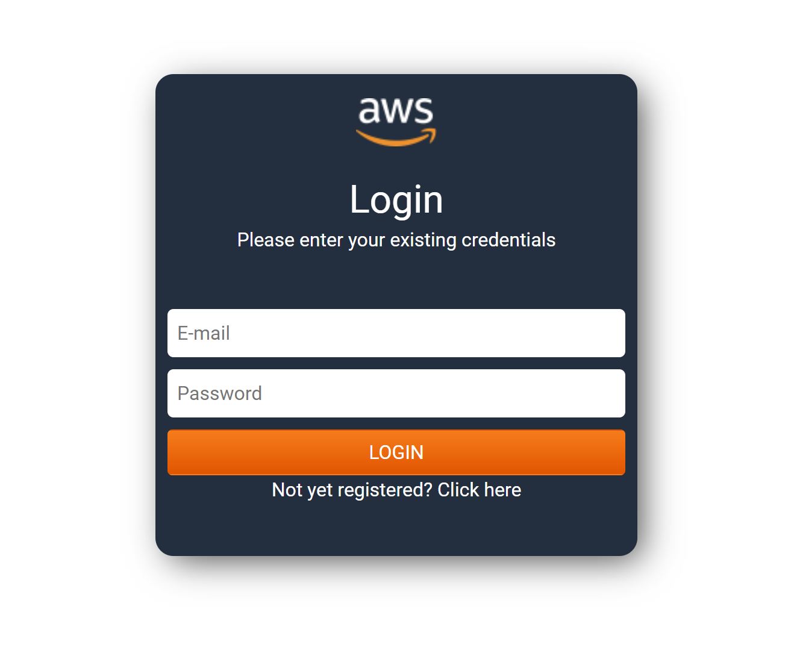

# Db Migration Proof-Of-Concept

## Objective

This project is a proof-of-concept to demonstrate how we can change the data source from two different databases (SQL Server and Postgres) on the fly.
PS: This app was not meant to be production-ready

## Technologies
Backend
  * .NET 5
  * EF Core

Frontend
  * ReactJS
## Prerequisites

* .NET 5 SDK
* NodeJS v14.x

## Installation

1. Browse to `DbSwapPOC.API` and edit the `appsettings.json` file
  * The `JWT_SIGNING_KEY` should be any random string with more than 20 characters used by the authentication module to sign the JWT tokens
  * `SqlConnection` and `PostgresConnection` should match the connection strings to your SQL Server and Postgres databases, respectively

1. Still in the `DbSwapPOC.API` folder, run `dotnet run`. This will download the dependencies, build the API project and run the backend
1. On a separate command prompt, browse to `../ui` and run `npm install` to install the frontend dependencies
1. run `npm start` (still in the ui folder) to start the frontend. This should 

PS: In case your backend is running on a different host and port than the default (http://localhost:5000), you need to alter the `REACT_APP_API_URL` key in `ui/.env.development`

## Features
* Login/Logout
* User Registration
* Departments grid (read-only)
* Employees grid (read-only)
* Change database source
* View database in use